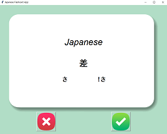
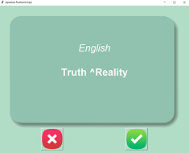

# 100 Days of Python
## Project 31: Flashcard App

The third Capstone project in the course.

This is a flashcard app for learning japanese vocabulary!
I am a Japanese culture enthusiast, and I have been learning japanese for a couple years now, so for my flashcard app I decided to make it for learning Japanese Kanji characters.
For the Kanjis database, I grabbed some json databases from [David Gouveia](https://github.com/davidluzgouveia) github's proyect [Kanji data](https://github.com/davidluzgouveia/kanji-data). He has some good proyects, go and check them!

Using flashcards is a good technique for vocabulary learning. In this app, a flashcard with a random Kanji will be shown to the user, then the user will have three seconds to recognize the kanji before the flashcard turns and shows the Kanji's meaning. If the user knows the Kanji meaning, he/she should click the check button, otherwise he/she should click the X button. The app will remember which Kanjis the user didn't know and save them in a CSV file. 

This project is divided into four parts to make it more understandable. 

The first part was to make the UI. For this I used four images. One for the "correct" button, one for the "wrong" button, one for the front card and one for the back card.
I will be using Tkinter module for the UI.

# First step
The first thing I did was to import the database in a file called kanji_database.py. Here I took all the data inside the "kanji-kyouiku.json" file using the json library. This is imported as a dictionary object, and I save it in a variable called kanji_dataset.

Then, using Try/Except I will try to open the kanjis_to_learn.csv file. If the file does not exist, in the Except part I will create a list with the Kanjis from the kanji_dataset.
I made this list a python object, and saved it as user_list. This way, I can keep track of the kanjis that the user does not know.

# Second step
Now, for the second step I will create the UI I will use for the app. I used Tkinter module for this. First, I set some variables I used in the GUI. I picked a random Kanji from the user_list, and using it as a key I looked for some definitions in the Kanji dictionary. Then, I created a window as a Tk object. Also, I loaded the images used in the project.

After the window, I created the canvas for the words in japanese and english. Since the first thing the user will see is the japanese Kanji, I used the create_text method with the Kanji_word and the on'yomi and kun'yomi readings. The last things I needed for the UI are the buttons. I created two buttons, one for the "right" option and one for the "wrong" option. For now, these buttons won't have a command. Here an image showing how is the window so far.

# Third step
After the GUI, I needed a function that after three seconds "flips" the flashcard and shows the user the meaning of the Kanji in english.
I defined a function called flip_card that will simple change the objects in the canvas to their english version. In the case of the on'yomi and kun'yomi readins, I will use a blank space so nothing appears in the canvas. Also, I need to add a after method where I created the window object, so my function is executed 3000 ms after the code began.
When the flashcard is flipped, the canvas will look like this

# Fourth step

The last thing I did was to create the functions for each button. The function for the wrong button is the easiest, because I just need to "flip" the flashcard back and add a new random Kanji. I defined a new function called new_word, which will do exactly that. Take a new random word from the user_list and change all the objects in the canvas back to japanese. Now, everytime the user click the "wrong" button, the flashcard will flip and show a new kanji.
For the "right" button I define another function called known_word. This function will take the Kanji out of the user_list, and save the list in the csv file, so this kanji does not appear again for the user. After this, the function will call the new_word function to make a new kanji appear in the canvas. 

I had to add a IF condition in the new_word function that checks the lenght in the user_list. If there are no items in the list, the window will close.
If the user want to start again, just <insdelete the kanjis_to_learn.csv<\ins file in the data folder.
