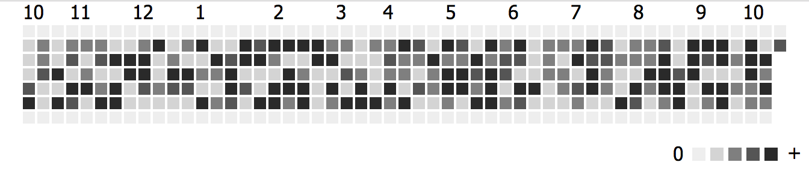

# 100 Days of Python
## Project 37: Habit Tracking APP

Here I made a small habit tracker that shows how many days in a row the user has done some activity, and how much activity per day. Here is an example of how:

For this I will be using the [Pixela](https://pixe.la/) website. Pixela has a Github you can check and support here: [Pixela's Github](https://github.com/a-know/Pixela)

Here I used other methods from HTTP requests. With these methods I can send, update and delete data from another program or website.

Following the "How do I use Pixela?" section, the first step is to create a username. Here you just need a username and a token which you can make yourself. The other parameters are agreeTermsOfService and notMinor, both must be Yes. In the response text should say "Sucess". You can see you user profile using this url with your username: http://pixe.la/@"username"

The second step is to create a graph definition. The endpoint for the graphs is the same as for the user creation but with /USERNAME/GRAPHS.
The parameters for the graph are:
* id: The graph ID
* name: The graph title
* unit: A text indicating the units. For this case units will be Km.
* type: The type of data in the graph
* color: The color of the squares.
* 
