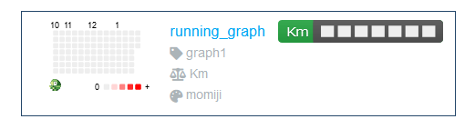

# 100 Days of Python
## Project 37: Habit Tracking APP

Here I made a small habit tracker that shows how many days in a row the user has done some activity, and how much activity per day. Here is an example of how:

For this I will be using the [Pixela](https://pixe.la/) website. Pixela has a Github you can check and support here: [Pixela's Github](https://github.com/a-know/Pixela)

I used other methods from HTTP requests. With these methods I can send, update and delete data from another program or website.

Following the "How do I use Pixela?" section, the first step is to create a username. Here you just need a username and a token which you can make yourself. The other parameters are agreeTermsOfService and notMinor, both must be Yes. In the response text should say "Success". You can see you user profile using this url with your username: http://pixe.la/@"username"

The second step is to create a graph definition. The endpoint for the graphs is the same as for the user creation but with /USERNAME/GRAPHS.
The parameters for the graph are:
* id: The graph ID
* name: The graph title
* unit: A text indicating the units. For this case units will be Km.
* type: The type of data in the graph
* color: The color of the squares. Here are used some japanese names for the colors.

Also, you need a Headers dictionary with your username Token, so the graph is created in YOUR Pixela's profile page. After running the code, you should see the response message with Sucess text. Now, you can browse https://pixe.la/v1/users/a-know/graphs/test-graph to see your graph and look for it in your Pixela's profile, like this:

Now, for the graph to show some data we need to send some information. In another dictionary I put today's date and through an input how many kilometers I ran. Again, using the post method with a new URL, I sent a request. If the return message was Success, then the graph was updated with the new data. You can reload your graph in your profile to see the changes. You can use different dates to fill up the graph, and see how it works.

After this, I played a bit with the put method. This method is to update data that is already in the website. For example, if I wanted to change the units from my graph from Km to calories. Or if I wanted to change the amount of Kms on a day, etc.

The last thing to try was the Delete method. This method is used to erase any data that is already in the website.

In this project I practice with not only getting data from APIs but sending, updating and deleting data. With this I can understand a bit better how powerful APIs really are.

---------------------------------------------------------------------------------------------------------------------------------------------------------------------------------

# 100 Días de Python
## Proyecto 37: APP de seguimiento de hábitos

Aquí hice una pequeña app para seguimiento de hábitos que muestra cuántos días seguidos el usuario ha hecho alguna actividad, y cuánta actividad por día. Aquí hay un ejemplo de cómo se ve la app:

Para esto estaré usando la página web y API de [Pixela](https://pixe.la/). Pixela tiene una página Github que puedes revisar y apoyar aquí: [Github de Pixela](https://github.com/a-know/Pixela)

Utilicé otros métodos del módulo HTTP requests. Con estos métodos puedo enviar, actualizar y borrar información de otro programa o página web.

Siguiendo la sección de "How do I use Pixela?", el primer paso es crear un usuario. Aquí solo necesitas el nombre de usuario y un Token que puedes hacer tú mismo. Los otros parámetros son agreeTermsOfService y notMinor, los cuales deben ser "yes". En el texto de response debería decir "Success". Ahora puedes observar tu perfil utilizando esta dirección web con tu nombre de usuario: http://pixe.la/@"username"

El segundo paso es crear un gráfico definido. La dirección web para los gráficas es la misma que para la creación de usuario pero con "/USERNAME/GRAPHS."
Los parámetros para el gráfico son:
* id: La identificación del gráfico
* name: El títlulo del gráfico
* unit: Un texto indicando las unidades. En esto caso serán Km
* type: El tipo de datos en el gráfico
* color: El color de los cuadros. Aquí se utilizan algunas palabras en japonés para los colores.

También, se necesita un diccionario de Cabecear with tu Token de usuario, para que el gráfico sea creado en un página de Pixela. Después de correr el código, deberías ver un mensaje de respuesta con el texto de "Success". Ahora puedes visitar https://pixe.la/v1/users/a-know/graphs/test-graph para ver tu gráfico, y puedes verlo en tu perfil de Pixela así:

Ahora, para que el gráfico muestre algún tipo de datos, debemos enviar información. En otro diccionario pusé la fecha de how, y a través de un input, cuántos kilometros. Nuevamente, utilizando el método post con un nuevo URL, envía el request.Si el mensaje retornado fue Success, entonces el gráfico fue actualizando con los nuevos datos. Puedes recargar tu gráfico en tu perfil y ver los cambios. Puedes utilizar diferentes fechas para llenar el gráfico con datos, y ver cómo funciona.

Después de esto, jugué un poco con el método PUT. Este método se utiliza para actualizar información que ya está en el sitio. Por ejemplo, si quisiera cambiar las unidades de mi gráfico de Km a calorias. O si quisiera cambiar la cantidad de kilometros en un día, etc.

Lo último que hice fue probar el método Delete. Este método es usado para borrar cualquier información que ya esté en la página web.

En este proyecto practiqué no sólo con recibir datos de APIs, sino enviando, actualizando y borrando datos. Con esto puedo entender un poco más el potencial real de las APIs.
