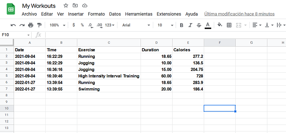

# 100 Days of Python
## Project 38: Workout tracking APP

A simple app that will keep track of different exercise you do in a day.
Using a natural language processing from [Nutritionix](https://www.nutritionix.com/) I did an app that will take a text from the user and will save the information in a Google Spreadsheet.

The information saved will be:
* Type of exercises done.
* duration of each exercise
* Estimated calories burnt
* The date

I will be using [Sheety](https://sheety.co/) to connect into my Google spreadsheets, and save all this information for me.

The first step was to setup the Nutritionix connection. I created an account, and got my user ID and a API key. This is needed for the headers authentication part.

I used the Natural Language endpoint to get the data I needed. [Here](https://docs.google.com/document/d/1_q-K-ObMTZvO0qUEAxROrN3bwMujwAN25sLHwJzliK0/edit#) is the documentation for it, in the Exercise Endpoints section.
Also [here](https://gist.github.com/mattsilv/d99cd145cc2d44d71fa5d15dd4829e03) is an Example of how to use this enpoint. 
Providing the user's information, the request will return a json file with all the data I need. I stored each data I needed in different variables. I used a FOR loop to go through each activity the user entered. To see if everything was going well, I printed a message for each activity done.

Then, I just needed to send this data to my spreadsheet. In sheety I created a new project called my_workouts. I enabled the Token security option, so the API asks for authorization every time I send or request data. For every exercise detected by the natural language processing app from Nutritionix, I saved them in my sheet. It will look like this:

Both Nutritionix and Sheety are great websites you can use for your project. I really like both. Sheety is an amazing tool for documents management from whenever you want. With just an API you can save, update, retrieve or deleta data from your spreadsheets and that's amazing for me!

---------------------------------------------------------------------------------------------------------------------------------------------------------------------------------

# 100 Días de Python
## Proyecto 38: App para seguimiento de ejercicio

Una app simple que hará seguimiento de distintos tipos de ejercicio que hagas en un día.
Utilizando procesamiento de lenguaje natural de [Nutritionix](https://www.nutritionix.com/) hice una app que tomará texto del usuario y guardará la información en una hoja de cálculo en Google.

La información a guardar será:
* Tipo de ejercicio hecho.
* duración de cada ejercicio.
* Estimado de calorías quemadas.
*  la fecha

Utilicé [Sheety](https://sheety.co/) para conectarme a mis hojas de cálculo de Google, y guardar esta información por mí.

El primer paso fue conectarme con Nutritionix. Creé una cuenta, y obtuve mi ID de usuario y mi llave API. Esto es necesario para la parte de auteticación.

Utilicé el método para Lenguaje natural para obtener la información que necesitaba. [Aquí](https://docs.google.com/document/d/1_q-K-ObMTZvO0qUEAxROrN3bwMujwAN25sLHwJzliK0/edit#) está la documentación para ello, en la sección de Exercise Endpoints.
[Aquí](https://gist.github.com/mattsilv/d99cd145cc2d44d71fa5d15dd4829e03) hay un ejemplo de cómo utilizar este método.
Dando información del usuario, el método requests retornará un archivo json con toda la información. Guardé cada dato que necesitaba en distintas variables. Utilicé un bucle FOR para ir por todas las actividades que el usuario ingresó. Para ver si todo estaba bien, imprimí un mensaje para cada actividad registrada.

Luego, sólo necesité envíar esta información a mi hoja de cálculo. En sheete creé un nuevo proyecto llamado my_workouts. Habilité la opción de seguridad con Toekn, así la API solicitará autorización cada vez que envíe o solicite datos. Por cada ejercicio detectado por el procesamiento de lenguaje natural de Nutritionix, guardé la información en la hoja de cálculo. Se verá así:

Tanto Nutritionix como Sheety son grandes sitio que puedes utilizar para proyectos. Me gustaron bastante los dos. Sheety es una herramiento sorprendente para el manejo de documentos desde dónde sea. Con sólo la API se puede guardar, actualizar, obtener o borrar datos de tus hojas de cálculo y eso me parece genial.
